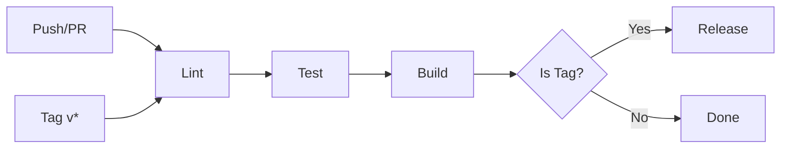

# CI/CD Pipeline Documentation

## Overview

The MCP Optimist project now has a **comprehensive, production-ready CI/CD pipeline** that automates:

- Code quality checks (linting & formatting)
- Testing with coverage
- Building artifacts
- Automated releases to GitHub and npm

## Architecture



## Pipeline Stages

### Stage 1: Lint ✨

**Purpose**: Ensure code quality and consistency  
**Duration**: ~30 seconds  
**Dependencies**: None

**Steps**:

1. Checkout code
2. Setup Node.js 18 with npm cache
3. Install pnpm globally
4. Install dependencies (frozen lockfile)
5. Run ESLint (`pnpm lint`)
6. Check Prettier formatting (`pnpm format:check`)

**Outcome**: Fails if linting errors or formatting issues detected

### Stage 2: Test 🧪

**Purpose**: Verify all functionality works correctly  
**Duration**: ~45 seconds  
**Dependencies**: Lint must pass

**Steps**:

1. Checkout code
2. Setup Node.js 18 with npm cache
3. Install pnpm globally
4. Install dependencies (frozen lockfile)
5. Run test suite (`pnpm test`)
6. Generate coverage report (`pnpm test:coverage`)
7. Upload coverage to Codecov

**Current Status**:

- ✅ 78 tests passing
- ✅ 5 test suites
- ✅ Coverage tracking enabled

**Outcome**: Fails if any test fails

### Stage 3: Build 🔨

**Purpose**: Compile TypeScript to JavaScript  
**Duration**: ~20 seconds  
**Dependencies**: Test must pass

**Steps**:

1. Checkout code
2. Setup Node.js 18 with npm cache
3. Install pnpm globally
4. Install dependencies (frozen lockfile)
5. Build project (`pnpm build`)
6. Upload dist/ artifacts (7-day retention)

**Outcome**: Fails if TypeScript compilation errors

### Stage 4: Release 🚀

**Purpose**: Publish package to GitHub and npm  
**Duration**: ~40 seconds  
**Dependencies**: Build must pass  
**Trigger**: Only on tags matching `v*`

**Steps**:

1. Checkout code with full history
2. Setup Node.js 18 with npm registry
3. Install pnpm globally
4. Install dependencies (frozen lockfile)
5. Download build artifacts from Build stage
6. Extract version from git tag (e.g., v1.0.0 → 1.0.0)
7. Update package.json version (no git tag)
8. Create GitHub Release:
   - Auto-generate release notes
   - Attach build artifacts
   - Mark as pre-release if alpha/beta/rc
9. Publish to npm (optional, continues on error)

**Requirements**:

- Tag must start with `v` (e.g., `v1.0.0`)
- NPM_TOKEN secret (for npm publishing)
- GITHUB_TOKEN (automatically provided)

**Outcome**: Creates GitHub Release and publishes to npm

## Workflow Triggers

### Continuous Integration (All Branches)

```yaml
on:
  pull_request:
    branches: [main]
```

**Runs**: Lint → Test → Build  
**Purpose**: Validate PRs before merge

### Continuous Integration (Main Branch)

```yaml
on:
  push:
    branches: [main]
```

**Runs**: Lint → Test → Build  
**Purpose**: Validate main branch integrity

### Continuous Deployment (Tags)

```yaml
on:
  push:
    tags:
      - 'v*'
```

**Runs**: Lint → Test → Build → Release  
**Purpose**: Automated releases

## Release Process

### Quick Release

```bash
# 1. Update version
npm version 1.0.0 --no-git-tag-version

# 2. Commit
git add package.json
git commit -m "chore: bump version to v1.0.0"
git push origin main

# 3. Tag and trigger release
git tag -a v1.0.0 -m "Release v1.0.0"
git push origin v1.0.0
```

### What Happens Next

1. GitHub Actions detects the tag
2. **Lint** runs → checks code quality
3. **Test** runs → all 78 tests must pass
4. **Build** runs → compiles TypeScript
5. **Release** runs → publishes to GitHub and npm

### Release Output

- ✅ GitHub Release created with notes
- ✅ Build artifacts attached to release
- ✅ Package published to npm (if configured)
- ✅ Version updated in package.json

## Configuration

### Secrets Required

#### GITHUB_TOKEN (Automatic)

- Automatically provided by GitHub Actions
- No configuration needed
- Used for creating releases

#### NPM_TOKEN (Optional)

**Purpose**: Publish to npm automatically

**Setup**:

1. Go to [npmjs.com](https://npmjs.com)
2. Navigate to: Account → Access Tokens
3. Create new "Automation" token
4. Copy token
5. In GitHub: Settings → Secrets → Actions → New secret
6. Name: `NPM_TOKEN`
7. Value: Paste token

**Without NPM_TOKEN**:

- Release will still work
- GitHub Release will be created
- npm publish step will be skipped (continues on error)

## Caching Strategy

**Node.js Setup**:

```yaml
- uses: actions/setup-node@v4
  with:
    node-version: '18'
    cache: 'npm'
```

- Caches npm dependencies
- Speeds up subsequent runs
- Reduces GitHub Actions minutes

**pnpm**:

```yaml
- name: Install dependencies
  run: pnpm install --frozen-lockfile
```

- `--frozen-lockfile` ensures reproducible builds
- Uses existing lockfile without modifications
- Fails if lockfile is out of sync

## Artifact Management

### Build Artifacts

**Uploaded After**: Build stage  
**Contains**: `dist/` directory (compiled JavaScript)  
**Retention**: 7 days  
**Size**: ~500KB

**Used By**:

- Release stage (downloads for publishing)
- Manual download for debugging
- Verification of build output

### Release Artifacts

**Attached To**: GitHub Release  
**Contains**: All dist/ files  
**Retention**: Permanent (with release)  
**Purpose**: Historical reference, debugging

## Status Badges

Add to your README.md:

```markdown
[](https://github.com/username/mcp-optimist/actions/workflows/ci.yml)
[](https://badge.fury.io/js/mcp-optimist)
[](https://codecov.io/gh/username/mcp-optimist)
```

## Monitoring

### GitHub Actions

View all workflow runs:

```
https://github.com/username/mcp-optimist/actions
```

### Codecov

View code coverage:

```
https://codecov.io/gh/username/mcp-optimist
```

### npm

View published packages:

```
https://npmjs.com/package/mcp-optimist
```

## Best Practices

### ✅ Do This

- Run tests locally before pushing
- Use semantic versioning (semver)
- Write meaningful commit messages
- Tag with descriptive release notes
- Keep lockfile in sync
- Review CI logs for warnings

### ❌ Don't Do This

- Skip tests before tagging
- Force push to main
- Delete tags that have releases
- Manually edit lockfile
- Ignore linting warnings
- Tag without version bump

## Troubleshooting

### Lint Stage Fails

**Symptom**: ESLint errors or formatting issues  
**Solution**:

```bash
npm run lint:fix
npm run format
git add -A
git commit -m "fix: lint issues"
```

### Test Stage Fails

**Symptom**: Tests failing in CI but pass locally  
**Solution**:

- Check Node.js version matches (18)
- Verify dependencies are up to date
- Look for environment-specific issues
- Check CI logs for specific test failures

### Build Stage Fails

**Symptom**: TypeScript compilation errors  
**Solution**:

```bash
npm run clean
npm run build
# Fix any TypeScript errors
git add -A
git commit -m "fix: TypeScript errors"
```

### Release Stage Skipped

**Symptom**: Release job doesn't run after tagging  
**Solution**:

- Ensure tag starts with `v` (e.g., `v1.0.0`)
- Verify tag was pushed: `git push origin --tags`
- Check tag matches pattern in workflow file

### npm Publish Fails

**Symptom**: Release created but npm publish fails  
**Solution**:

- Check NPM_TOKEN is configured correctly
- Verify package name isn't taken
- Ensure version isn't already published
- Check npm account has publish permissions

## Performance Metrics

### Current Timings

- **Lint**: ~30 seconds
- **Test**: ~45 seconds (78 tests)
- **Build**: ~20 seconds
- **Release**: ~40 seconds
- **Total**: ~2 minutes 15 seconds (for full release)

### Optimization Opportunities

- ✅ npm caching enabled
- ✅ Frozen lockfile for reproducibility
- ✅ Parallel-safe dependencies
- ⏭️ Could add matrix testing (multiple Node versions)
- ⏭️ Could parallelize lint/test if needed

## Version History

| Version | Date       | Changes                                      |
| ------- | ---------- | -------------------------------------------- |
| 1.0     | 2024-11-17 | Initial CI/CD pipeline implementation        |
|         |            | - 4 stage pipeline (lint/test/build/release) |
|         |            | - npm and GitHub release automation          |
|         |            | - Coverage reporting                         |
|         |            | - Artifact management                        |

## Future Enhancements

### Planned

- [ ] Multi-version Node.js testing (matrix strategy)
- [ ] Docker image building and publishing
- [ ] Slack/Discord notifications on release
- [ ] Automated changelog generation
- [ ] Dependency vulnerability scanning
- [ ] Performance benchmarking

### Under Consideration

- [ ] Canary deployments
- [ ] Rollback automation
- [ ] Release preview comments on PRs
- [ ] Integration test environment
- [ ] Automated documentation deployment

---

**Status**: ✅ Production Ready  
**Last Updated**: 2024-11-17  
**Maintained By**: MCP Optimist Team
